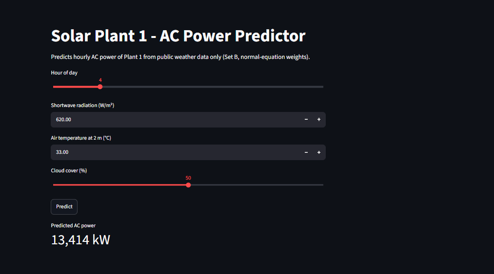
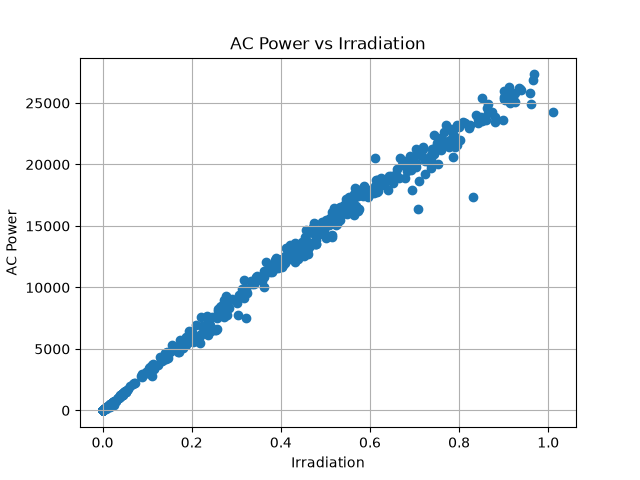
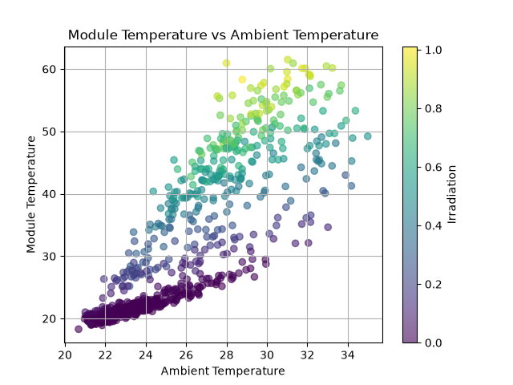
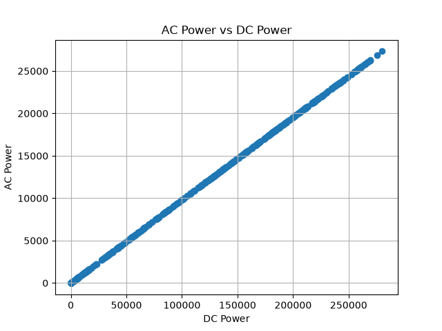
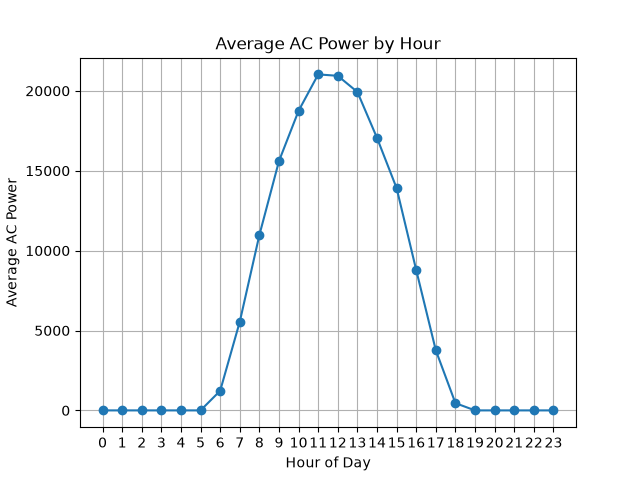
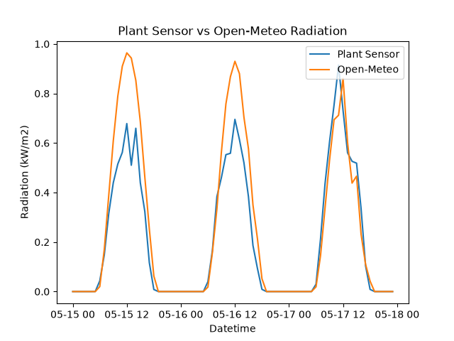
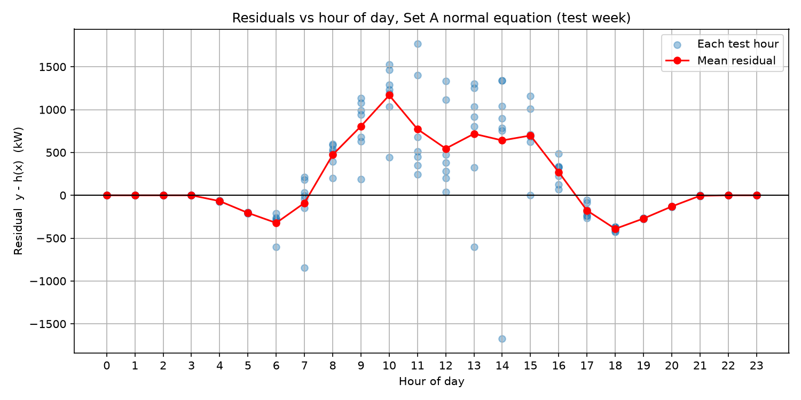
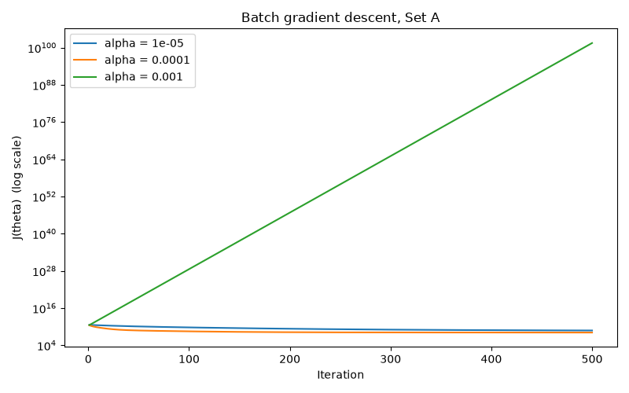
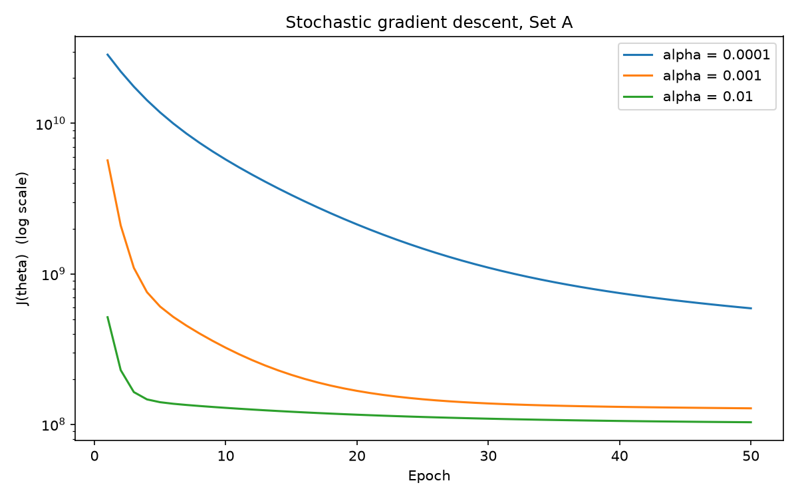
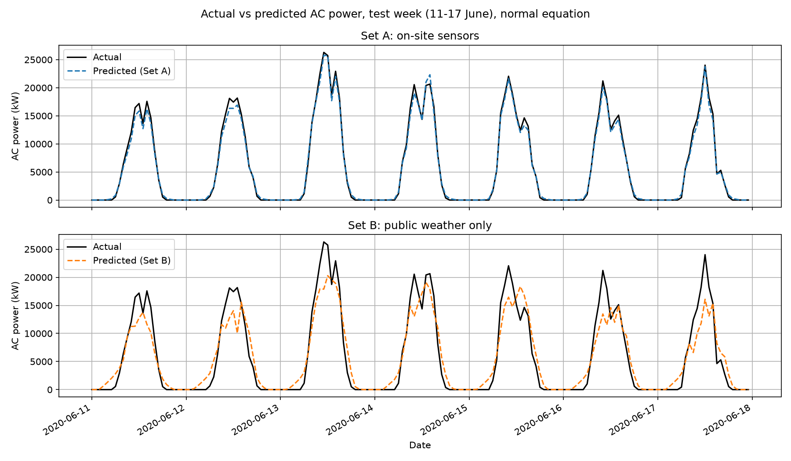

# Predicting Solar Power Plant Output from Weather

**AI4003 – Applied Machine Learning, Assignment 1 (Fall 2026)**

> How much prediction accuracy is lost when the on-site irradiation and temperature sensors are replaced by free public weather data downloaded from the internet?

We predict the hourly AC power output of a solar plant in India (Plant 1, near Gandikota, Andhra Pradesh) with linear regression implemented by hand in NumPy. We compare two feature sets:

- **Set A:** on-site sensors (irradiation, module temperature, ambient temperature)
- **Set B:** public weather only (shortwave radiation, air temperature, cloud cover), from [Open-Meteo](https://open-meteo.com)

We fit each set with three solvers: the normal equation, batch gradient descent and stochastic gradient descent. No machine-learning libraries are used.

## Short answer

| | Daytime test RMSE | % of peak hourly power (27,326 kW) |
|---|---|---|
| Set A: on-site sensors | 723 kW | 2.6% |
| Set B: public weather | 3,418 kW | 12.5% |

Replacing the sensors with public weather data raises the daytime error by about **2,694 kW, or 9.9% of the plant's peak power**. Public weather data is good enough for rough energy estimates, such as sizing a rooftop system. It is not accurate enough for hour-by-hour prediction.

## Repository layout

```
data/                     raw Kaggle CSVs, plant1_hourly.csv, plant1_openmeteo.csv
src/Load_data.py          given data loader
src/prepare.py            Task 1: parse timestamps, merge, resample to hourly
src/eda.py                Task 2: exploratory plots
src/fetch_weather.py      Task 3: download Open-Meteo data, verify location
src/regression.py         hypothesis, cost, fit_normal, fit_batch_gd, fit_sgd, rmse
src/train_eval.py         Task 4: scaling, learning-rate search, fits, test RMSE
results/table/            Tables 1–3 as CSV
results/figures/          all figures
results/analysis.md       written answers for Tasks 2 and 5
results/weights.json      saved θ and scaling statistics (used by the app)
app/app.py                Task 6: Streamlit front end
```

## Setup

Requires Python 3.9 or newer.

```
pip install numpy pandas matplotlib requests streamlit
```

Download the [Solar Power Generation Data](https://www.kaggle.com/datasets/anikannal/solar-power-generation-data) from Kaggle, unzip it, and put the four CSV files in `data/`:

```
Plant_1_Generation_Data.csv
Plant_1_Weather_Sensor_Data.csv
Plant_2_Generation_Data.csv
Plant_2_Weather_Sensor_Data.csv
```

## How to run

Run every command from the **project root**, in this order, because each script uses files created by the one before it:

```
python src/prepare.py          # -> data/plant1_hourly.csv, Table 1 (part)
python src/eda.py              # -> 4 exploratory plots
python src/fetch_weather.py    # -> data/plant1_openmeteo.csv, location check, Table 1
python src/train_eval.py       # -> Tables 2 and 3, learning-rate / prediction / residual plots, weights.json
```

`fetch_weather.py` needs an internet connection. Open-Meteo does not need an API key.

## Front end

```
streamlit run app/app.py
```

Then open http://localhost:8501. Enter the hour of day, shortwave radiation (W/m²), air temperature (°C) and cloud cover (%). The app returns the predicted AC power using the saved Set B weights.

> Use `streamlit run`, not `python app/app.py`.



## Method

- **Data preparation:** the two Plant 1 files use different date formats, so each is parsed separately. Power is summed over the 22 inverters, merged with the sensor data on timestamp, and resampled to hourly means. Rows with missing values are dropped.
- **Location check:** sensor irradiation and Open-Meteo radiation peak at the same hour, give or take one hour, on the three days checked. This confirms the coordinates (14.82, 78.28) and time zone (Asia/Kolkata).
- **Split by date, no shuffling:** train on 15 May – 10 June, test on 11 – 17 June.
- **Features:** each set has 3 weather features plus sin(2πh/24) and cos(2πh/24), standardised with training-set mean and standard deviation only, plus an intercept column.
- **Solvers:**
  - normal equation θ = (XᵀX)⁻¹Xᵀy
  - batch GD with α = 10⁻⁴ for 50,000 iterations
  - SGD with α = 10⁻² for 50 epochs

  Learning rates were chosen from J(θ) curves on the training set.
- **Evaluation:** predictions are clipped at 0. RMSE is reported on all test hours and on daytime hours only (irradiation > 0).

## Results

### Table 1 – Data preparation

| | |
|---|---|
| Raw generation rows (Plant 1) | 68,778 |
| Raw sensor rows (Plant 1) | 3,182 |
| Timestamps in only one file | 26 |
| Hourly rows after resampling | 816 |
| Hourly rows with missing values | 20 (dropped) |
| Open-Meteo rows downloaded | 816 |
| Peak hour, sensor vs. Open-Meteo | 15 May: 12:00 vs 12:00 · 16 May: 12:00 vs 12:00 · 17 May: 11:00 vs 12:00 |

### Table 2 – Test-set RMSE (kW)

| Solver | Features | All hours | Daytime only |
|---|---|---|---|
| Normal equation | Set A | 553.32 | 723.41 |
| Batch GD (α=10⁻⁴, 50,000 iters) | Set A | 553.32 | 723.41 |
| Stochastic GD (α=10⁻², 50 epochs) | Set A | 562.91 | 736.73 |
| Normal equation | Set B | 2626.13 | 3417.65 |
| Batch GD (α=10⁻⁴, 50,000 iters) | Set B | 2626.13 | 3417.65 |
| Stochastic GD (α=10⁻², 50 epochs) | Set B | 2479.75 | 3141.98 |

### Table 3 – Learned θ (Set A)

| | Normal eq. | Batch GD | SGD |
|---|---|---|---|
| θ0 intercept | 6883.42 | 6883.42 | 6887.67 |
| θ1 irradiation | 8258.30 | 8258.30 | 7652.30 |
| θ2 module_temp | −25.54 | −25.54 | 819.70 |
| θ3 ambient_temp | −15.93 | −15.93 | −224.31 |
| θ4 sin hour | −29.83 | −29.83 | −45.78 |
| θ5 cos hour | −408.77 | −408.77 | −408.10 |
| Max \|θ_GD − θ_normal\| | – | 0.00014 | 845.24 |

Batch GD matches the normal equation to within 0.00014. SGD with a fixed learning rate stays close to the minimum but does not settle exactly on it.

### Figures

| | |
|---|---|
|  |  |
|  |  |
|  |  |
|  |  |



Full written analysis: [results/analysis.md](results/analysis.md)

## Link

- Medium blog: https://medium.com/@moomaleman41/do-you-need-sensors-on-the-roof-predicting-a-solar-plants-output-from-free-weather-data-818bd4c396fb?postPublishedType=repub


## Team

- Moomal_Eman
- Tayyba Bashir
